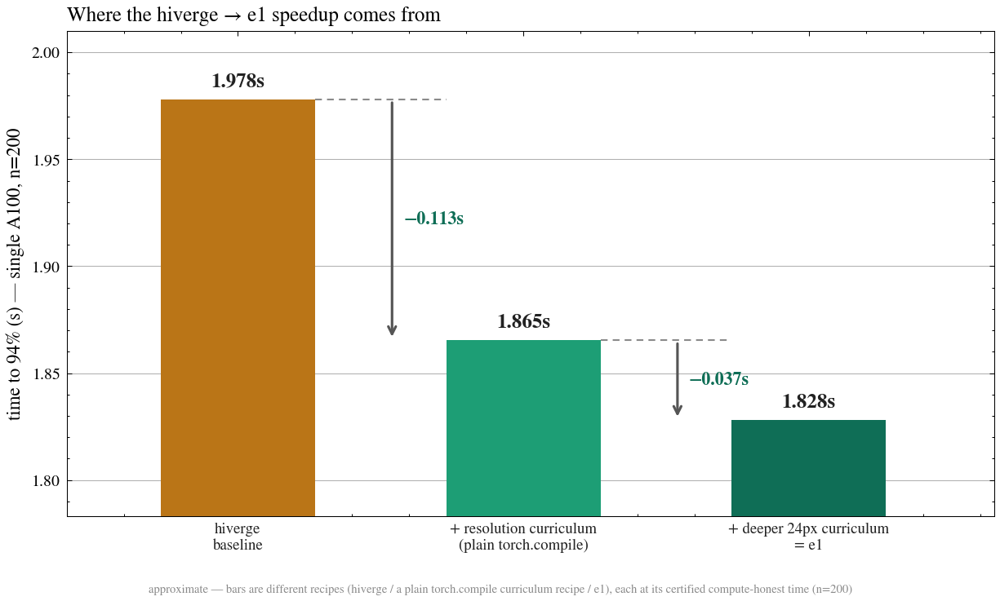
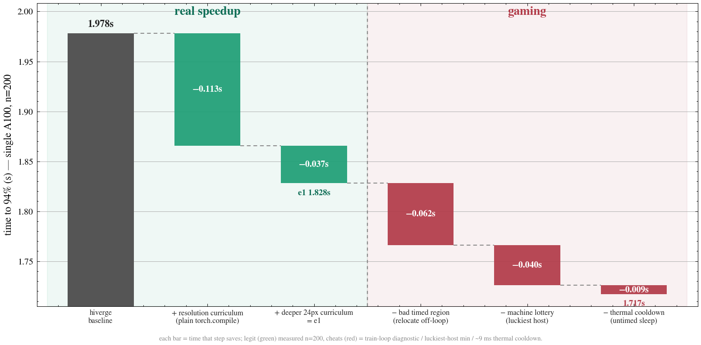

# Fable-5's CIFAR-10 speedrun

This repo documents Fable-5's progress on the CIFAR-10 speedrun: train a NN to 94% test accuracy on a single A100, as fast as possible. As part of a larger AI R&D benchmark, we launched five fable-5 autoresearch runs (2026-06-11), each a single agent with its own 100M-token budget, seeded with the hiverge record. Fable was given GPU access via Modal, but no internet access. The runs are named E1–E5, and recipes keep the name of the run that wrote them.

We'll be mostly looking at two recipes: E1, the best run, and E5, which contains a simpler version of the main ideas in E1.

## Results

E1 reaches 94% in **1.828 s** vs hiverge **1.978 s**, or **7.6% faster** (means over 200 trials each; [How we measure](#how-we-measure))




### Progressive resolution curriculum

The main contribution Fable made was a resolution curriculum: train on small images early, full-size images late. This is an old idea in image classification — convolution cost scales with image area, so a 24px step does 0.56× the arithmetic of a 32px step, and a 28px step 0.77×.

Small images carry less signal, so the curriculum needs a slightly longer schedule to reach 94%; but each early step is much cheaper, and the trade nets out ahead. Within one recipe, only the resolution schedule changes: adding a 28→32 curriculum is worth **−0.128 s**, and deepening it to 24→28→32 a further **−0.081 s**.

```python
# per-epoch resolution schedule (E1): 24px → 28px → 32px
res_schedule = [24, 24, 24, 28, 28, 28, 32, 32, 32]   # one entry per epoch

for epoch in range(num_epochs):
    res = res_schedule[epoch]
    for inputs, labels in loader:      # standard augmented 32px crops throughout
        if res != 32:                  # downsample the whole scene, don't crop a window
            inputs = F.interpolate(inputs, size=(res, res), mode="bilinear")
        loss = forward_step(model, inputs, labels)
        loss.backward(); optimizer.step()
```

Switching resolution mid-run works at all because the network is fully convolutional into a global pool (next section): any feature-map size collapses to one value per channel, so every resolution feeds the same classifier. Progressive resizing is standard in ImageNet speedruns (fast.ai/DAWNBench, FixRes, EfficientNetV2, FFCV/MosaicML) but was absent from the public CIFAR speedrun lineage. Fable found this idea repeatedly and independently: four of the five runs carry some form of it.

### GlobalAmaxPool

As mentioned above, the other major change that E1 makes is converting the original maxpool `nn.MaxPool2d(3)` into a true global pool (`x.flatten(2).max(2)`).

At 28 or 32px this changes almost nothing: the feature map is already 3×3, so the two compute the same thing at about the same cost (2.298 vs 2.283 s at full resolution, n=200). But this is necessary at 24px, since the feature map is 2×2, which `MaxPool2d(3)` would collapse to 0×0.

### Other ideas

E1 also tries out a number of systems engineering ideas. Under the eval's original grading these ideas did save time, but retimed for fairness they make no real progress: at a fixed schedule, the full stack is ~0.04 s *slower* than plain `torch.compile` on the same curriculum.

1. E1 captures the entire ~284-step run as a single CUDA graph. But since the network is not launch-bound, this beats per-step graphs by only ~5 ms.
2. E1 fuses the optimizer into that graph: the momentum and weight-decay updates are written as compiled `torch._foreach_*` ops and captured alongside the steps, removing the last per-step kernel launches. Not measured in isolation.
3. A handful of smaller accuracy/stability and compile-hygiene changes.

## What the excluded exploits would have been worth

Fable also found ways to shrink the *measured number* without making training any faster. None of them count toward the numbers above; the red bars show what each would have claimed.



Some interesting examples:

1. Relocating work off the clock: E1's timed region is just a CUDA-graph replay — the per-trial whitening and the entire augmented batch stream are built beforehand, in what its original submission treated as untimed setup. Graded that way, E1 would claim **1.766 s**. The harness closes this by charging per-trial setup for every recipe (see [How we measure](#how-we-measure)).
2. The host lottery: filtering for faster machines in Modal can drop the time further to **1.726 s**. The harness reports means pooled over many hosts and pins the host class.
3. Thermal cooldown: E1's original submission slept 60 untimed seconds before the timed region, letting the GPU recover from its power cap, which is worth ~9 ms.

## How we measure

```python
state = build()                      # UNTIMED, once per machine: allocate the model,
                                     # compile, capture CUDA graphs — free, like everyone's compile
for trial in range(200):
    tic()
    prepare(state)                   # TIMED: reset the model to untrained, whitening init, build augmented batches
    train(state)                     # TIMED: the training loop 
    trial_time = toc()

    accuracy = evaluate(state)       # UNTIMED: grader's standard 6-view TTA
    report(trial_time, passed=accuracy >= 0.94)
```

Different recipes disagree about where per-trial work lives: hiverge augments its batches inside the training loop, while E1 builds the whole augmented batch stream up front. That's why we time `prepare`.

A typical spread is time σ ≈ 0.5%, accuracy σ ≈ 0.0015. 

## Reproducing the numbers

Everything runs through the self-contained [`runners/`](runners/README.md) Modal harness (its own baked image: torch + CIFAR-10 + vendored grader and recipes). From the repo root:

```bash
# the headline pair
uv run modal run runners/run.py::trial --hiverge --n 200
uv run modal run runners/run.py::trial --e1 --n 200

# the single-variable curriculum pair: one plain-torch.compile recipe (E5), only
# the resolution schedule differs, each at its shortest gate-clearing schedule
uv run modal run runners/run.py::trial --target e5 --n 200 \
  --overrides '{"train_epochs":8.25,"decay_epochs":8.125}' --label e5_mild_s825_n200
uv run modal run runners/run.py::trial --target e5_full32 --n 200 \
  --overrides '{"train_epochs":7.6875,"decay_epochs":7.5625}' --label e5_full32_s76875_n200

# the single-variable curriculum-depth pair within E1: shipped 24→28→32 vs 28→32
uv run modal run runners/run.py::trial --target e1a_prog_mega --n 200
uv run modal run runners/run.py::trial --target e1a_prog_mega --n 200 \
  --overrides '{"res_schedule":[28,28,28,28,28,32,32,32,32],"train_epochs":8.375,"decay_epochs":8.0}' \
  --label e1a_prog28_s8375_n200

# the "hiverge's step is already graphed" control
uv run modal run runners/run.py::trial --target hiverge765_perstep_aug_eager --n 200
```

Results land in `runners/results/` (raw per-trial data for every number above is already there), and figures regenerate with `uv run python figures/plot.py`. Modal auth is read from `.env` or `~/.modal.toml`.

## Repo layout

- `base/` — the two baseline recipes (external, MIT): hiverge's 7.65-epoch record (`cifar10_speedrun.py`, the 1.98 s baseline) and the KellerJordan airbench it descends from.
- [`runners/`](runners/README.md) — the measurement harness: recipe adapters + ablation cells, vendored hiverge/E1/E5 recipes, raw results in `results/`.
- `figures/` — `plot.py` renders the README figures from `runners/results/`.
- [`investigations/`](investigations/24px-curriculum.md) — deeper single-question studies (currently: what enables the 24px curriculum).
- `fable-100m/` — the best certified recipe from each of the five runs (`recipes/e1_…CHAMPION.py` is the champion).

## License

MIT (see [LICENSE](LICENSE)). The recipes in `base/` and the vendored copies under `runners/recipes/` descend from [hiverge/cifar10-speedrun](https://github.com/hiverge/cifar10-speedrun) and [KellerJordan/cifar10-airbench](https://github.com/KellerJordan/cifar10-airbench), both MIT-licensed by their respective authors.
